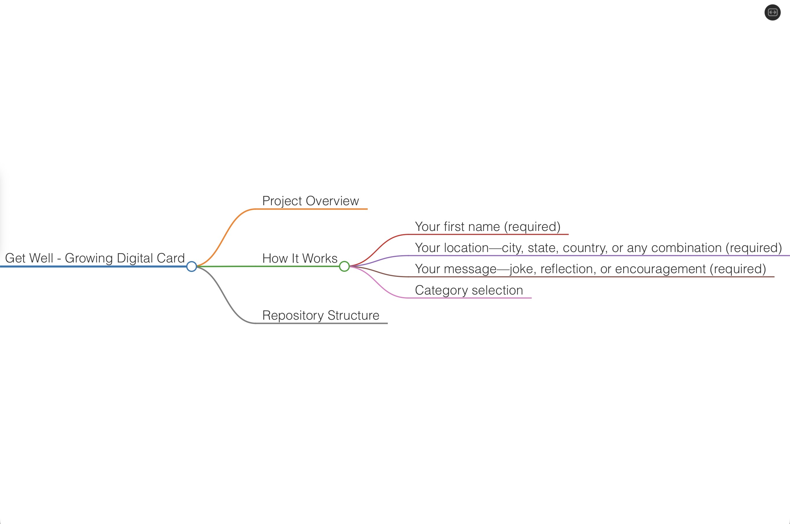

# Get Well - Growing Digital Card



## Project Overview

I built Get Well as a universal digital card that anyone, anywhere in the world can use to send or receive encouragement. It's designed to be a living, growing collection of joy, reflections, and uplifting messages that gets richer over time as more people contribute.

The concept is simple: a digital card that never runs out of space, never gets old, and can be shared instantly with anyone who needs their spirits lifted. Whether someone is recovering from illness, going through a hard time, or just needs a smile, this card is here for them.

**Live Site:** https://supercodingninja.github.io

---

## How It Works

People submit messages with their first name and location—like "Ginny from Ohio" or "Hakim from Turkey"—and those messages become part of the rotating collection. The card keeps growing as more people add their voices from around the world.

**Submission includes:**
* **Your first name** (required)
* **Your location**—city, state, country, or any combination (required)
* **Your message**—joke, reflection, or encouragement (required)
* **Category selection**

---

## Repository Structure

```text
/GetWell/
├── index.html          # Main entry point
├── app.js             # Application logic
├── styles.css         # Styling
├── filters.js         # Content moderation
├── manifest.json      # PWA config
├── sw.js              # Service worker
├── firebase.json      # Firebase hosting
├── firestore.rules    # Database security
├── .gitignore         # Git exclusions
├── .gitattributes     # Git settings
├── IMG_1714.jpeg      # App structure diagram
└── README.md          # This file

Branch: LivingCard (deploys to GitHub Pages)

Firebase Setup
I configured this to use Firebase Firestore so the card can grow continuously. To make it work with your Firebase project:
1. Go to Firebase Console
2. Open project "Growing Get Well Card"
3. Project Settings → General → Your apps
4. Copy the config values into app.js:

const firebaseConfig = {
    apiKey: "YOUR_API_KEY",
    authDomain: "growing-get-well-card.firebaseapp.com",
    projectId: "growing-get-well-card",
    storageBucket: "growing-get-well-card.appspot.com",
    messagingSenderId: "YOUR_SENDER_ID",
    appId: "YOUR_APP_ID"
};

The app will seed itself with starter content on first launch, then accumulate new submissions over time.

Video Hosting
I host background videos via GitHub Releases to avoid the 100MB repository limit:
* Landing: github.com
* Main: github.com
If you need to update videos, create a new release and update the URLs in app.js.

Content Moderation
I use the PurgoMalum API to keep submissions clean without storing profanity lists in the codebase:
Endpoint: www.purgomalum.com
All submissions are checked before being added to the global collection.

Features
* Personal attribution: Every message shows the author's first name and location
* Universal access: Works on any device with a browser
* Continuously growing: Database expands with each new submission
* Content moderation: Automatic screening via PurgoMalum API
* Glass morphism UI: Modern frosted glass design
* Video backgrounds: Ambient footage with fallback gradients
* PWA capable: Install to home screen
* Offline functionality: Service worker caching
* Keyboard navigation: Arrow keys, spacebar, escape
* Mobile responsive: Works on phones and tablets

Technical Notes
Why GitHub Releases for Video Hosting
Hosting large MP4 files directly in the repository hits GitHub's 100MB limit. By attaching videos to release v1.0-videos, I gain direct download URLs and GitHub's CDN for fast delivery.

Firebase Firestore for Continuous Content
I implemented Firestore so the app truly lives up to its name—"Growing Get Well Card." The database seeds itself on first launch with starter content, then accumulates user submissions over time. Security rules allow public reading of approved content while restricting edits to authenticated users only.

Content Moderation Strategy
I check both the message content and the author information (name + location) against the PurgoMalum API to ensure everything stays appropriate.


Copyright
Copyright © 2026 Frederick Thomas (The Super Coding Ninja™). All rights reserved.

License
MIT License
Permission is hereby granted, free of charge, to any person obtaining a copy of this software and associated documentation files (the "Software"), to deal in the Software without restriction, including without limitation the rights to use, copy, modify, merge, publish, distribute, sublicense, and/or sell copies of the Software, and to permit persons to whom the Software is furnished to do so, subject to the following conditions:
The above copyright notice and this permission notice shall be included in all copies or substantial portions of the Software.
THE SOFTWARE IS PROVIDED "AS IS", WITHOUT WARRANTY OF ANY KIND, EXPRESS OR IMPLIED, INCLUDING BUT NOT LIMITED TO THE WARRANTIES OF MERCHANTABILITY, FITNESS FOR A PARTICULAR PURPOSE AND NONINFRINGEMENT. IN NO EVENT SHALL THE AUTHORS OR COPYRIGHT HOLDERS BE LIABLE FOR ANY CLAIM, DAMAGES OR OTHER LIABILITY, WHETHER IN AN ACTION OF CONTRACT, TORT OR OTHERWISE, ARISING FROM, OUT OF OR IN CONNECTION WITH THE SOFTWARE OR THE USE OR OTHER DEALINGS IN THE SOFTWARE.

"A merry heart doeth good like a medicine" - Proverbs 17:22
